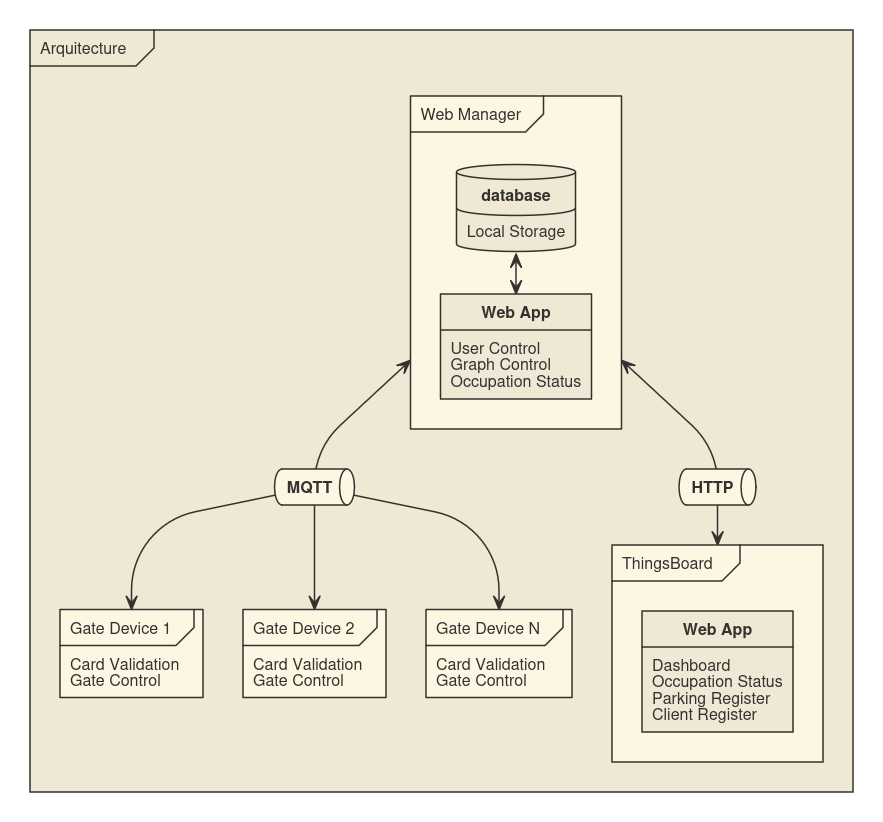

# IoT System for Parking Management

Project developed in the IoT discipline at Ufes by David Propato & Klarine Mendonça.

This project is a distributed IoT system for intelligent parking management, composed of three main modules:

-   **Web Manager**
-   **Gate Control (Gate Device)**
-   **ThingsBoard (Monitoring and Visualization)**

Each module has specific responsibilities and communicates to ensure the integrated operation of the system.

## Infrastructure



> Fig. 1: Diagram showing how the system is divided, connected and the main responsibilities of each module.


> Fig. 2: Diagram showing the main tools used in each module.

---

## Module Overview

### 1. Web Manager


> Fig. 3: Web Manager Interface, showing the page to register the graph and calculate the paths.

The Web Manager module is responsible for:

-   Registering and editing the graph that represents the parking lot map (slots, gates, paths, entries and edges connecting the nodes).
-   Calculating the shortest paths between points in the parking lot.
-   Communicating via HTTP and MQTT with gate devices and the ThingsBoard system.
-   Managing occupancy and vehicle movement data.

> For technical details, prerequisites, and usage instructions, see the [Web Manager README](./trabalhos-Ufes-IoT-web-manager/README.md).

---

### 2. Gate Control (Gate Device)


> Fig. 4: Electronic Schematic of the Gate Device.

This embedded module performs:

-   Access control to the parking lot using RFID for user identification/slot registration.
-   Logging entries and exits, sending data to the Web Manager.
-   Physical gate control using a servo motor (open/close).
-   Communication with the Web Manager via MQTT.

> For technical information, installation, and common issues, check the [Gate Control README](./trabalhos-Ufes-IoT-gate-control/README.md).

---

### 3. ThingsBoard


> Fig. 5: ThingsBoard Dashboard, showing total occupancy and occupancy over time.

The ThingsBoard module is responsible for:

-   Registering the device that represents the parking lot and gate device.
-   Real-time and historical visualization of occupancy data.
-   Integration with the Web Manager for displaying collected data.

> For details on configuration, running, and stopping, see the [ThingsBoard README](./trabalhos-Ufes-IoT-ThingsBoard/README.md).

---

## How the System Works

1. **Parking Lot Registration:** The administrator uses the Web Manager to register the parking lot map.
2. **Access Control:** Users enter and exit the parking lot using RFID at the gates, which log and send data to the Web Manager.
3. **Monitoring:** The Web Manager processes the data and sends it to ThingsBoard, where it can be viewed in real time and analyzed historically.

---

## Technical Documentation

Each module has its own README with detailed information about:

-   Prerequisites
-   Installation and execution
-   Stopping
-   Common issues and solutions

Refer to the specific README of each module for detailed instructions.

---

## Project Structure

```text
trabalhos-Ufes-IoT/
├── trabalhos-Ufes-IoT-web-manager/   # Web management and communication
├── trabalhos-Ufes-IoT-gate-control/  # Embedded gate device
└── trabalhos-Ufes-IoT-ThingsBoard/   # Monitoring and visualization
```
